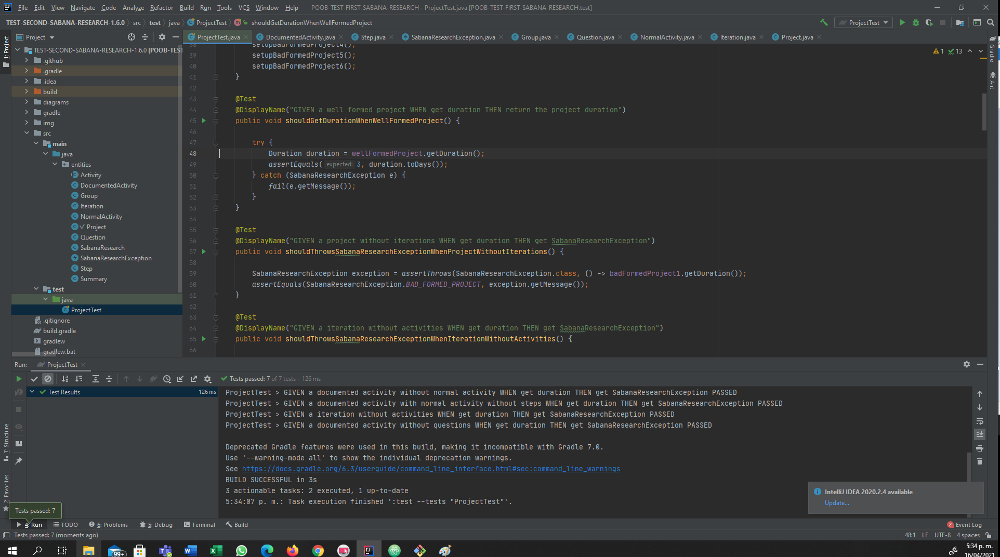

 # POOB-TEST-FIRST-SABANA-RESEARCH Parcial !

 ## Diagrama de Memoria

 

 ## Diagrama UML

 

 ## Diseño
 

 ### Conceptos

 ¿Qué es encapsulamiento? ¿Qué ventajas ofrece?

 Encapsulamiento es el ocultamiento de datos de un objeto de manera que solo se pueda cambiar mediante las operaciones definidas para ese objeto.

 Esto permite ocultar informacion a las otras clases, y solo mostrar lo que el sistema requiera sin dar la información de un objeto a todo mundo

 ¿Qué es ocultación de información? ¿Por qué aplicarla? ¿Cómo se implementa en Java?

 La ocultación de iformacion es el encasulamiento mencionado anteriomente, se aplica para resguadar los datos de un objeto, se implementa mediante la definicion de los atrivitos del objetos, ya sea con el private, que se encarga qeu solo la clase pueda tener acceso a la información, y public que permite a cualquier clase quetenga una instancia del objeto pueda acceder a esta información.

 # Parcial # 2

 # IMPLEMENTANDO

 ## Evidencia Pruebas

 

 # DISEÑANDO

/**
Genera un tipo de resumen dependiendo del tipo de resumen

return El resumen dependiendo del TypeOfSummary
param TypeOfSummary
*/

 Public List<List<String>> summarize(String TypeOfSummary)

 

 

 # EXTENDIENDO

 

 De los diseños resultantes del punto I y II, ¿Qué debe cambiar? ¿Qué no debe cambiar?

 Debe cabiar las relaciones existente si entre una actividad y una interaccion, sin embargo no se debe modificar la estructura de estas clases, ya que se debe usar otra clase que me permita identificar la dependencia necesario de la actividad

 Teniendo en cuenta los cambios necesarios ¿Que fue bueno y que fue malo de su diseño?

 Lo bueno de los diseños anteriores fue que ya estaban estructurados de una forma que para generar dependencia de otras clases o de la misma, no era necesario realizar muchos cambios, por lo cual solo requirió crear un a clase abstracta que nos permitiera esta, sim embargo lo malo fue que esto provoco demasiadas denuncias a la clase dependency entonces si algo le ocurre a la clase las actividades no funcionarían.

 # CONCEPTOS

 1. ¿Cuáles son las acciones los tres momentos importantes de las excepciones? ¿Cuál es el objetivo de cada una? ¿Cómo se implementa en Java cada acción?.

 Las tres acciones de las excepciones son:

 * Lanzar
 Lazar se encarga de como su nombre lo dice votar la excepcion cuando el metodo se lo indique

 en java se hace mediante

 throw new TipodeException(mensaje)

 * Propagar
 Es el momento en el que el metodo hace llegar la excepcion a donde sea implementado

 en java se hace mediante en la firma del metodo

 modificador de acceso - metodo(parametros) throws TipodeExcepcion

 * Capturar
 Es el momento en el que un metodo recibe un excepcion y la captura y decide que hacer con ella

 en java se hace con

 try{}
 catch{}
 finally{}       

 2. ¿Qué es sobre-escritura de métodos? ¿Por qué aplicarla? ¿Cómo impedir que se sobre-escriba un método?.

la sobre-escritura es cuando una clase quiere modificar el cuerpo de un metodo que hereda o implementa, esto se hace cuando una clase comparte el metodo pero lo realiza de una forma diferente o se nesesita modificar algo.

para evitar que se pueda modificar se coloca final en la firma del metodo

 # SonarQube

 ## Evidencia

